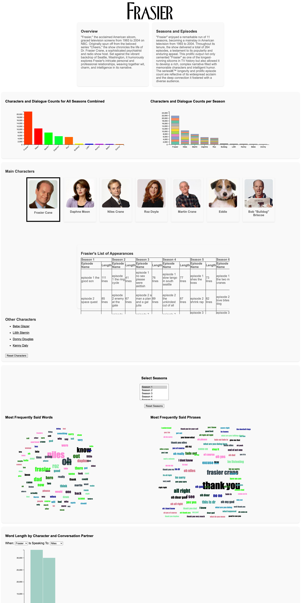

# Exploring Frasier

[](https://d3js.org/)
[](https://developer.mozilla.org/docs/Web/JavaScript)


A data-visualization dashboard built on the complete dialogue of _Frasier_ — all
264 episodes across 11 seasons. Pick a character, scope it to a range of seasons,
and explore who talks the most, what they say, and who they say it to.



## What you can explore

- **Dialogue counts** — a bar chart of the most talkative characters across the
  whole series, and a stacked bar chart breaking each character's lines down by
  season.
- **Word and phrase clouds** — select a character (and a span of seasons) to see
  their most frequently said words and multi-word catchphrases, sized by
  frequency.
- **Per-character appearances** — a season-by-season table of the episodes a
  character appears in and how many lines they have.
- **Word-length histogram** — the distribution of line lengths between any two
  characters (who is speaking, and who they are speaking to).
- **Conversation arc** — a "who speaks to who" arc diagram for a chosen season,
  highlighting a character's conversation partners on hover.

## From transcripts to the dashboard

The dashboard never parses raw transcripts in the browser. Instead, a set of
Node build scripts under `lib/` pre-aggregate the episode transcripts into the
compact JSON the front end loads:

```
data/frasier_transcripts/season_*/episode_*.json   (raw, per-episode transcripts)
                  │
                  ▼   node lib/<script>.js
                  │
data/frasier_transcripts/*.json                     (aggregates the app loads)
```

| Build script                     | Produces                           | Used by                               |
| -------------------------------- | ---------------------------------- | ------------------------------------- |
| `lib/process_all_season.js`      | `character_data_whole_season.json` | series-wide bar chart                 |
| `lib/process_by_season.js`       | `characters_by_season.json`        | stacked bar chart, word/phrase clouds |
| `lib/process_by_episode.js`      | `characters_by_episode.json`       | per-character appearance tables       |
| `lib/conversations_by_season.js` | `conversations_by_season.json`     | conversation arc                      |

The raw per-episode transcripts are kept in the repo so the aggregation step is
fully reproducible — re-run a build script and the corresponding JSON regenerates.

## Running it locally

Because the charts load JSON over `fetch`, the page must be served over HTTP
rather than opened as a `file://`:

```bash
# from this folder
python3 -m http.server 8000
# then open http://localhost:8000 in your browser
```

The word and phrase clouds appear once you select a character.

## Code layout

```
index.html                 # page layout, styles, and script wiring
js/
├── main.js                # entry point: selection state, data loading, view setup
├── barchart.js            # series-wide dialogue counts
├── stacked-barchart.js    # dialogue counts per character, stacked by season
├── word-length-histo.js   # line-length distribution between two characters
├── conversation-arc.js    # per-season "who speaks to who" arc diagram
└── d3.v6.min.js           # vendored D3 v6
lib/                       # Node build scripts: transcripts -> aggregated JSON
data/                      # raw transcripts + aggregated JSON
public/images/             # character portraits and logo
```

## Notes

- Built with D3.js v6 and the [d3-cloud](https://github.com/jasondavies/d3-cloud)
  layout plugin; word clouds are styled with the Impact typeface.
- The code has been cleaned up and documented for this archive; the
  visualization logic itself is unchanged.
