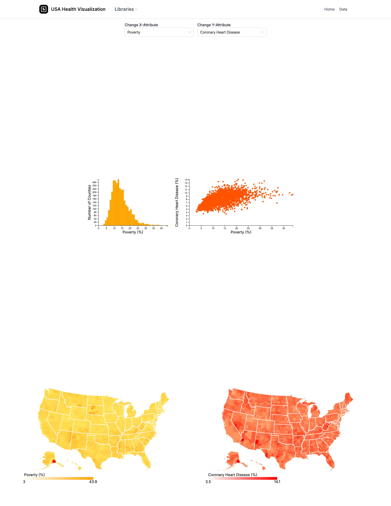

# USA County Health Visualization

[](https://nextjs.org/)
[](https://www.typescriptlang.org/)
[](https://d3js.org/)
[](https://tailwindcss.com/)

An interactive dashboard for exploring the factors that shape the health of US
counties. Choose any two attributes — poverty, income, education, smoking,
air quality, heart disease, and more — and compare them across four coordinated
views built on a single national dataset.



## Coordinated views

Every chart is wired to a shared `CentralDataStore`, so brushing a selection in
one view highlights the same counties everywhere else (brushing and linking).

- **Histogram** — how counties are distributed across the chosen X-attribute.
- **Scatter plot** — the X-attribute against the Y-attribute, one point per
  county, to surface correlations.
- **Two choropleth maps** — the X- and Y-attributes mapped side by side so
  geographic patterns line up visually. Brushing a region on a map filters the
  other views.

The two X/Y dropdowns at the top drive all four charts at once.

## Tech stack

- **Next.js** (Pages Router) + **TypeScript** for the app shell and UI.
- **D3.js** + **TopoJSON** for the visualizations. Each chart is a plain D3
  class under `src/lib/` wrapped in a thin React component under
  `src/components/Charts/`; the charts are loaded with `next/dynamic` and
  `ssr: false` because they manipulate the DOM directly.
- **Tailwind CSS** and **Ant Design** (the attribute selectors) for styling.

## Running it locally

```bash
npm install
npm run dev
# open http://localhost:3000
```

## Project layout

```
src/
├── pages/index.tsx          # dashboard page: attribute selectors + chart layout
├── components/
│   ├── Charts/              # React wrappers around the D3 chart classes
│   └── Navbar/              # top navigation
└── lib/
    ├── ChoroplethMap.js     # county map (used for both X and Y maps)
    ├── Histogram.js         # distribution chart
    ├── Scatterplot.js       # X vs Y scatter
    ├── CentralDataStore.js  # shared state for linked brushing
    └── data.ts              # attribute metadata + CSV processing
public/data/                 # national_health_data.csv + county geometry
```

## Notes

- The data is US county health statistics joined to county geometry
  (`counties-10m`).
- Cleaned up for this archive: the two maps now share one `ChoroplethMap`
  component (an earlier copy-pasted duplicate was removed) and debug logging was
  stripped. The visualization behavior is unchanged.
