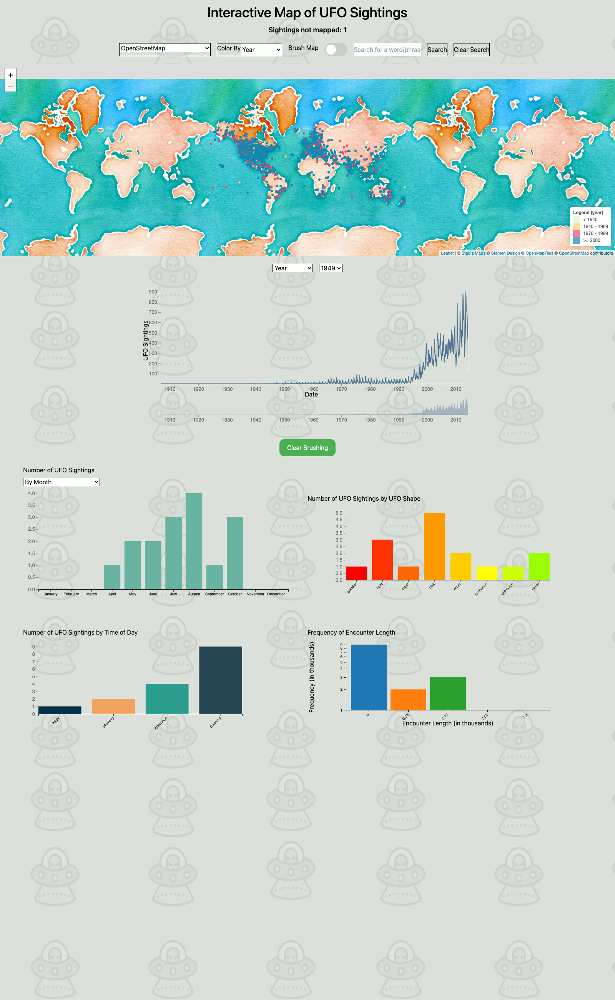

# Interactive Map of UFO Sightings

[](https://d3js.org/)
[](https://leafletjs.com/)
[](https://developer.mozilla.org/docs/Web/JavaScript)


An interactive dashboard for exploring decades of reported UFO sightings across
the world. A Leaflet map and five linked D3 charts let you slice the data by
year, location, shape, and time — and every view stays in sync as you filter.



## Coordinated, linked views

The dashboard is built around **brushing and linking**: interacting with one
view filters all the others, through a shared `CentralDataStore`.

- **World map** (Leaflet) — every sighting as a point, with **color-by**
  attribute, switchable base layers, and **rectangular area-select** to brush a
  region.
- **Timeline** — sightings over time, with a draggable brush to filter to a date
  range.
- **Annual-cycle histogram** — counts grouped by month, day of the week, or season.
- **Shape bar chart** — sightings by reported UFO shape.
- **Time-of-day bar chart** — morning / afternoon / evening / night.
- **Encounter-length frequency** — how long encounters reportedly lasted.
- **Full-text search** — count how often a word or phrase appears across all
  sighting descriptions.

## Running it locally

Because it loads CSV data via ES modules, it needs to be served over HTTP (not
opened as a `file://`):

```bash
# from this folder
python3 -m http.server 8000
# then open http://localhost:8000 in your browser
```

The map base layers and the larger charts may take a moment as the full dataset
(~80k sightings) loads.

## Data

| File | Contents |
|------|----------|
| `data/ufo_sightings.csv` | The main dataset — date/time, location, coordinates, shape, encounter length, and description for each sighting |
| `data/encounter_data.csv` | Pre-aggregated encounter-length buckets |
| `data/ufo_frequency.csv` | Pre-aggregated frequency series |

The full sighting data is kept in the repo because the cleaned version isn't
readily available elsewhere.

## Code layout

```
js/
├── main.js              # entry point: load data, wire filters/search, build views
├── CentralDataStore.js  # shared state enabling linked brushing across views
├── leafletMap.js        # the map: points, color-by, base layers, area-select
├── timeline.js          # brushable timeline
├── cycleHistogram.js    # month / day / season histogram
├── barchart.js          # by UFO shape
├── tod.js               # by time of day
├── bc.js                # encounter-length frequency
└── d3.v6.min.js, leaflet*.js   # vendored libraries
```

## Notes

- Built with D3.js v6, Leaflet, TopoJSON, and Tailwind CSS.
- **Group project** — built with a team for a data-visualization course; my work
  spanned the map interactions, linked brushing, and several of the charts.
- The custom code has been cleaned up and documented for this archive; the
  visualization logic itself is unchanged.
