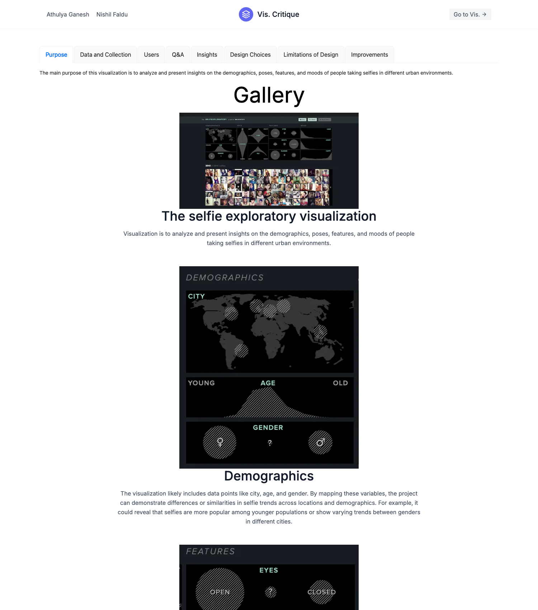

# Visualization Critique — Selfiecity

[](https://nextjs.org/)
[](https://www.typescriptlang.org/)
[](https://tailwindcss.com/)

A website that critiques a published data visualization in detail — in this case
the [Selfiecity Selfiexploratory](https://selfiecity.net/selfiexploratory/),
which analyzes ~3,840 Instagram selfies across several cities by demographics,
pose, facial features, and mood.



## What it covers

The critique is organized as a set of tabs, each examining a different facet of
the visualization:

- **Purpose** and **Data & Collection** — what the visualization sets out to do
  and the dataset behind it.
- **Users** — the audiences it serves and what each gets from it.
- **Q&A** and **Insights** — the questions a viewer can answer, and how to read
  each chart (mood, glasses, mouth, eyes, tilt, turn, pose, age/gender, city).
- **Design Choices**, **Limitations of Design**, and **Improvements** — an
  evaluation of what works, what holds it back, and what would make it stronger.

Below the tabs, a gallery walks through annotated screenshots of the original
visualization.

## Tech stack

- **Next.js** (App Router) + **TypeScript**.
- **Tailwind CSS** for layout and **Ant Design** for the tabs.
- Critique copy lives in `lib/data/children.ts`; the gallery screenshots are in
  `public/`.

## Running it locally

```bash
npm install
npm run dev
# open http://localhost:3000
```

## Project layout

```
src/app/
├── layout.tsx              # root layout + metadata
├── page.tsx               # renders the tabbed critique
├── globals.css
└── _components/
    ├── Navbar.tsx          # header with a link to the original visualization
    ├── AntdTabs.tsx        # the critique tabs + gallery
    └── Slide.tsx           # a single annotated gallery image
lib/data/children.ts        # the critique text content
public/                     # screenshots of the Selfiecity visualization
```

## Notes

- **Group project** — written with a partner for a data-visualization course.
- The original visualization being critiqued lives at
  [selfiecity.net](https://selfiecity.net/selfiexploratory/).
